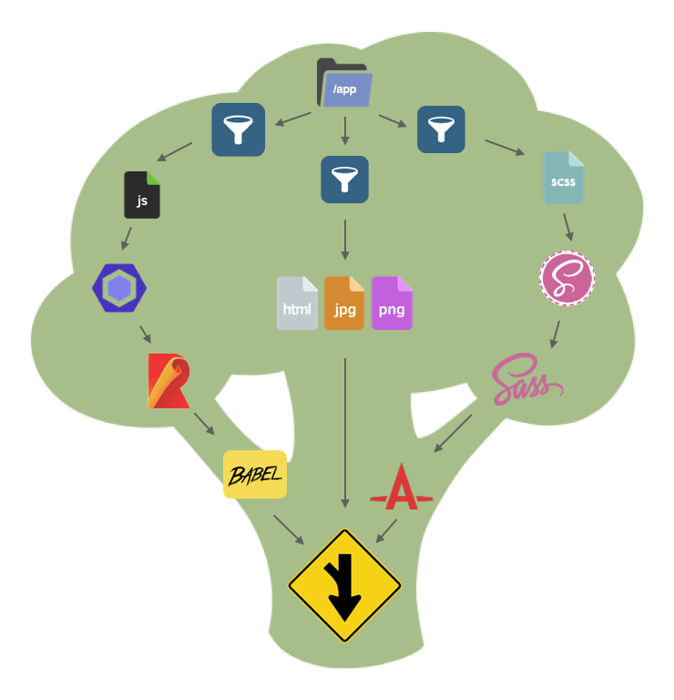

# Eat your greens! Broccoli.js for beginners

Welcome to the world of Broccoli.js. So, I'm sure you're wondering, what _is_ Broccoli.js?

Well, per the [Broccoli.js website](http://broccolijs.com)

> The asset pipeline for ambitious applications

Cool, wait, what the hell does that mean?

<!-- more -->

"Ambitious applications"? That sounds scary, I just wanna make a
simple JS app, with ES6 transpilation, SCSS pre-processing, asset concatenation, live reload, uglification,
vendor npm module inclusion, developement server, and, oh, wait, perhaps it's ambitious.

Oh, yeah, and I want all that to be fast.

Historically, we had grunt, and decided we didn't like configuration files.
Then we had gulp, because we wanted to write code to compile our code, then it got slow.
Then we had webpack that does bundling, minifaction, source maps, code splitting, but, it's kinda hard to configure.
So Broccoli.js provides a simple Javascript API to do simple and complex file transformations, and do it fast.

## Follow along

Here's a talk I gave at EmberNYC meetup in Jan 2017 that covers most of this article.

[Watch EmberNYC video](https://www.youtube.com/embed/JTzvYJBxwyI?start=141&end=1377)

[](https://www.youtube.com/embed/JTzvYJBxwyI?start=141&end=1377)

## Enter Broccoli.js.

What is a build tool responsible for? Well, it's job is to take input files (your javascript, css, html, etc) and
process them, to output them into some form of distributable version. Typically this will involve things like javascript
transformations to allow you to use newer syntax that will work in a browser, to use things like Sass for your CSS, etc.

So, how is Broccoli any different? Broccoli is a simple build management tool, that allows you to configure your build
pipeline in javascript (like you're already used to writing), and handles setting up the filesystem state for each
transformation that's going to happen.

Broccoli is structured around a concept of `nodes` and `plugins`, that allows the build pipeline to be structured
somewhat like a "tree", with one or more inputs at the top, and a final output directory at the bottom, containing the
result of the build.

Nodes reference one or more input directories, and an output directory. The output directory is automatically created by
Broccoli itself.

Plugins are third party provided npm packages, that take one or more input nodes (directories), perform some kind of
transformation, and emit files to an output path. This output path can then become an input path to the next node in the
chain, and so on.

Nodes can then be manipulated via various broccoli plugins, to do things like copy files to the destination directory,
pre-process files and convert them from one format to another (e.g. .scss to .css), merge directories together (think
rsync'ing one directory into another), concatenate files of a certain type into one (bundling), uglifying, and so on.

### How do nodes work?

Nodes are what Broccoli uses to represent snapshots of directories and the transformations between states.

Note that the term `tree` in Broccoli is often used to refer to a `node` and was the previously used to refer to
them (so don't get confused if you see the term tree used in other documentation).

Nodes themselves don't actually contain file contents, and manipulations to the nodes don't happen when they are created.
They're essentially abstract representations of state, they can be combined, split, filtered for specific file types,
etc.

Broccoli handles creating the node graph, that is, connecting the output paths of one or more nodes, to the input paths
of another that will be consumed by the next plugin.

Nodes are always one of two types, `source` nodes and `transform` nodes.

`source` nodes represent a single input directory, and are implicitly created when you use a `string` as an input to a
plugin. Typically source nodes are "watched" directories, and chages to any files within them will trigger a rebuild of
their node "tree". You can also create unwatched directories for things like vendor files that don't change often.

`transform` nodes represent one or more input nodes, and are typically created by the output of plugins. Transform nodes
delegate to a callback object (a plugin) during build time.

### How do plugins work?

State transformations are performed by plugins. Plugins receive one or more input nodes, and write their output to the
provided `outputPath` that Broccoli creates. Broccoli then takes the contents of `outputPath` and provides that as the
`inputPaths` for the node to the next plugin.

Plugins take at least one input path, perform some processing on the files within those input paths, and write their
result to the provided `outputPath` and Broccoli handles wiring all this up for you. This way each plugin is only
concerned with the transformation that it needs to do.

Plugins can also cache their output, based usually on the hashes of their input paths, or any other factor.
This way if the inputs to a plugin have not changed, then the plugin can supply a previously built output.

Plugins are very simple JS classes that accept one or more input nodes, and implement a `build()` method that
is called when broccoli performs a (re)build.

### Trees

You will certainly encounter the term "tree" when looking for Broccoli documentation. This was an often-used term that
has now been replaced with "node", as node reflects the data structure better than a "tree". With this in mind, I prefer
to use the term "tree" to refer to an entire build pipeline, or a collection of nodes and plugins.

An example Broccoli.js tree is represented in the following image:



From the output node (the one at the bottom), a tree structure can be derived.

### Building

Broccoli build pipelines are defined using a `Brocfile.js` file in the root of the project. This `js` file
defines the `source` nodes, passes them through various plugins creating `transform` nodes, and finally
returns a single node that represents the final output of the build. Broccoli will then handle wiring up
all of the nodes inputs and outputs into a graph (from the end node up to the start nodes), creating temporary
directories as it goes, linking files between plugins using symlinks to make them super fast, run the build and invoke
the `build()` method on each plugin, and finally resolve all the symlinks and write the files from the final node into
the destination build directory.

Confused? Here's an example:

```js
const mergeTrees = require("broccoli-merge-trees"); // broccoli merge-trees plugin
module.exports = mergeTrees(["dir1", "dir2"]);
```

This is a very simple `Brocfile.js` that merely merges the contents of `dir1` and `dir2` into the output
directory. The node graph would be represented as follows:

```
source node
            =====> transform node
source node
------------------------
/dir1 => source node 1
/dir2 => source node 2
mergeTrees(
    'dir1', => source node, implicitly created when using a string as an input
    'dir2' => source node, implicitly created when using a string as an input
)
module.exports = transformation node with input nodes dir1 and dir2
```

Thus `module.exports` contains a node that references the two input nodes, and an output path that will contain the
contents of `dir1` and `dir2` when the `build` command is run. The two input nodes reference two source directories,
`dir1` and `dir2`.

It sounds like a lot, but it's actually quite simple, so let's get started with a simple Broccoli app.

### Serving

One last thing. Broccoli comes with a built in dev server, that provides an HTTP server to host your assets
in development, and perform rebuilds when source directories (nodes) change.

To run the server, do:

`broccoli serve`

This should start a local HTTP server on `http://localhost:4200`

## Tutorial

Each step of the tutorial has an accompanied branch, so you can checkout the branch if you get lost and you should be
able to build the project and see the output. Remember to run `yarn` when checking out new branches.
All the documentation is in the `docs` folder, split into sections.
